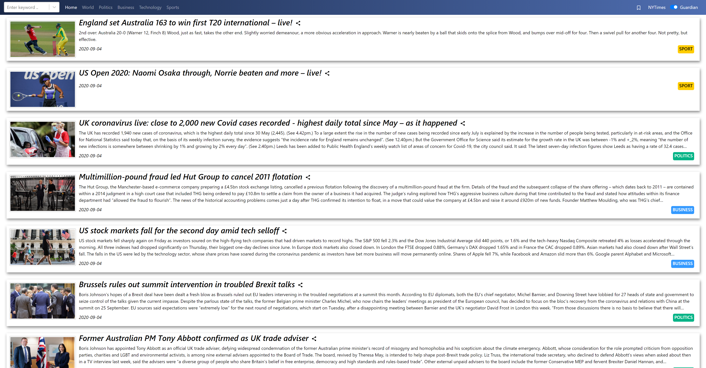
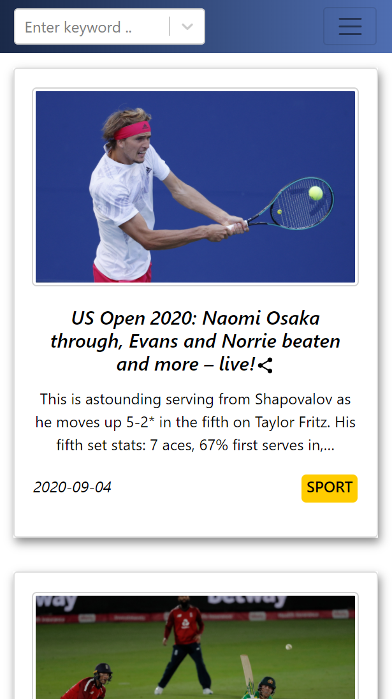

# NewsWebsite-React-FullStack
This is a news website  
Frontend was built with React.  
Backend was built with Node.js using express framework.  
MongoDB is used to store news information.  



## Table of Contents
- [Prerequisites](#Prerequisites)
- [Installation](#Installation)
- [Rebuild-project](#Rebuild-project)
- [Features](#Features)

## Prerequisites
- Node.js  
Node.js can be downloaded from <a href="https://nodejs.org/en/">`https://nodejs.org/en/`</a>  
- npm  
    npm can be installed using command
    ```
    sudo npm install -g npm@latest
    ```

## Installation
1. Clone the repository or download all files.
2. install npm packages for both frontend and backend
    ```
    npm install 
    ```
## Rebuild-project 
1. Get API keys
    - 1.1 Guardian News API  
    Visit <a href="https://open-platform.theguardian.com/access/">`https://open-platform.theguardian.com/access/`</a>. Register for developer key and on the subsequent page, enter details as asked. Once you click register, a key will be emailed to you on the email address you use.  
    Once you received your API key, copy and paste the key into file "server.js" located in backend/src.
    - 1.2 New York Times API  
    Visit <a href="https://developer.nytimes.com/get-started">`https://developer.nytimes.com/get-started`</a>. Follow the instructions on this page and you will get your API key.  
    Once you find your API key, copy and paste the key into file "server.js" located in backend/src as well.
    - 1.3 Bing Autosuggest API  
    Visit <a href="https://azure.microsoft.com/en-us/services/cognitive-services/autosuggest/">`https://azure.microsoft.com/en-us/services/cognitive-services/autosuggest/`</a>. Click "Try Bing Autosuggest" and opt for either the Free Azure account version or the existing account version. Click "create a resource" find Bing Autosuggest. Click "create" and fill in the details and click "create" at the bottom (F0 is free, make sure the pricing tier is F0 if you just want to git it a try). Finally, go to your resource and get your API key at "Keys and Endpoint" section.  
    Copy and paste the key into file "Autosuggest.js" located in frontend/src/components.
    - 1.4 CommentBox.io API  
    Visit <a href="https://dashboard.commentbox.io/login">`https://dashboard.commentbox.io/login`</a>. Create a account or login using exist account. Once log in, create a new project. Enter Website name and Website domain. (Make sure Domain name must be correct, if you run your project locally, domain is localhost:port_number or 127.0.0.1:port_number, default port number for react app is 3000). Keep the default selections and skip over the remaining questions which are optional. Click “Create Project”. Then, you can see your project ID, copy and paste it into file "CommentBox.js" located in frontend/src/components.
2. Run the app
    - 2.1 start backend
        ```
        cd backend\src
        node server.js
        ```
    - 2.2 start frontend
        ```
        cd frontend
        npm start
        ```
    If you did every steps correct, a web page will be displayed.
## Features
1. Navbar  
    - User can type into search box where list of suggestions will be given. Click any one of the suggestions will direct user to the search page.
    - Different button will restrict the source of the news to specific section including Home, World, Politics Business, Technology and Sports.
    - Click Bookmark button will display all the favourite news. These news are saved in local storage and will not disappear if user close the browser.
    - Switch button can change the source of the news between New York Times and Guardian. 
2. Home page and section page
    - News are displayed in a news box which contains abstract of the news.
    - User can share the news via share button.
    - Click each news card will direct to article page where more details of this news will be displayed.
3. Article page
    - Can share news with facebook, twitter or email.
    - Click bookmark button will mark this news as favourite and can retrieve this news later.
    - Click thumb will upvote this news.
    - If the detail of the news is long. A chevron down icon will be displayed. Click this button will display the remaining part of the news.
    - User can leave a comment at the bottom of the news either anonymously or onymously.
4. Search page
    - Top 10 results related to user's input will be displayed in new card.
    - Click each card will direct user to article page.
5. Favourite page
    - All your saved news will be shown in this page.
    - Click trash button will delete this news from favourite list.
    - Click each card will direct user to article page. 
6. Responsive Web design
    - Web page will adjust for different screen sizes and viewports.  
    